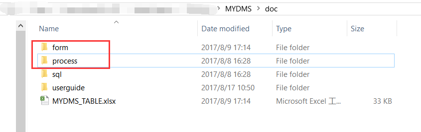

# DMS部署手册

--------

|日期|版本|作者|
|:---------:|:---------:|:---------:|
|2017/08/17|Version 1.0| 周兴怀 |

> **注意**，当前版本DMS只支持**ORACLE**数据库，浏览器只支持最新版Chrome跟火狐，**不支持IE**！

## 初始化数据库

* 在路径 */doc/sql/oracle* 中，依次执行 `create_table.sql` 跟 `insert_data.sql`，将表和初始化数据插入到数据库中。

## 导入表单流程

* 分别将 */doc/form* 和 */doc/process* 中的表单流程导入GP，注意，导入时去掉 `_clone`。

* 流程导入成功后，打开流程设计师, 为 *文件新增申请单*, *文件变更申请单*, *文件作废申请单* 设定发起权限。

> 由于 *文件新增申请单*, *文件变更申请单*, *文件作废申请单* 这三张单子必须在DMS系统页面中才能操作发起流程，不允许在“发起流程”页面手动发起，所以，可以在设定权限属性当中选择一名IT人员，以此限制其他员工在“发起流程”页面发起这些流程。

## 部署war/ear

* 将 [附件](https://git.oschina.net/digiwin/MYDMS_DOC/attach_files) 下的 `bpm-dsm.war` 和 `zMYDMSLockApp.ear` 拷贝到 GP */server/default/deploy* 目录下，用解压软件打开 `bpm-dsm.war` 包（不需要解压），打开 `WEB-INF/classes/dms.properties` 文件。

* 修改数据库信息为当前GP的数据库信息，然后保存，重启Jboss。

> **注意** 如果ORACLE数据库版本不是12C,则 `bpm-dms.war` 中 `/WEB-INF/lib/ojdbc6.jar` 替换为 [附件](https://git.oschina.net/digiwin/MYDMS_DOC/attach_files) 中的 `ojdbc14-10.2.0.4.0.jar`，如下图：

## 模组程式维护

* 用administrator账号登录GP，在“系统管理工具 > 模组程式维护” 中添加DMS左侧菜单栏，如下表所示，添加4条程式清单并保存:

|程式代号|程式名称|连线 Url|
|:---------|:---------|:---------|
|mydmsparameter|设置|/bpm-dms/docParameter?userId=<#userId>|
|mydmsreports|报表|	/bpm-dms/reports|
|mydmssearch|搜索|/bpm-dms/login/search/<#userId>|
|mydmstree|文件树|/bpm-dms/login/tree/<#userId>|

