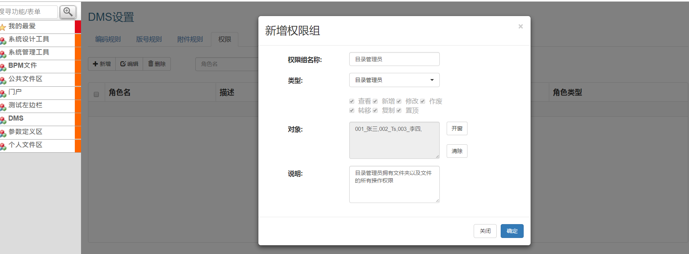
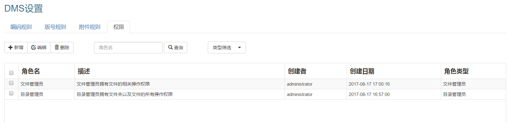
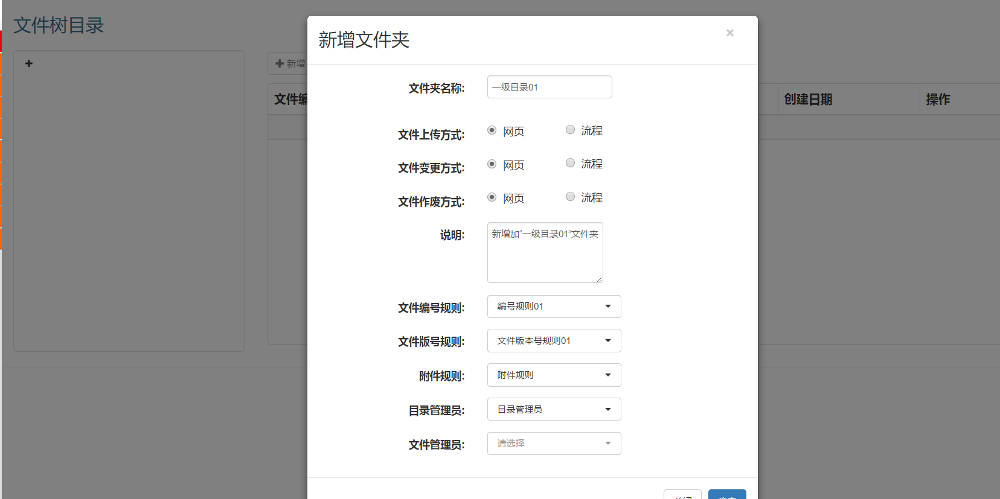
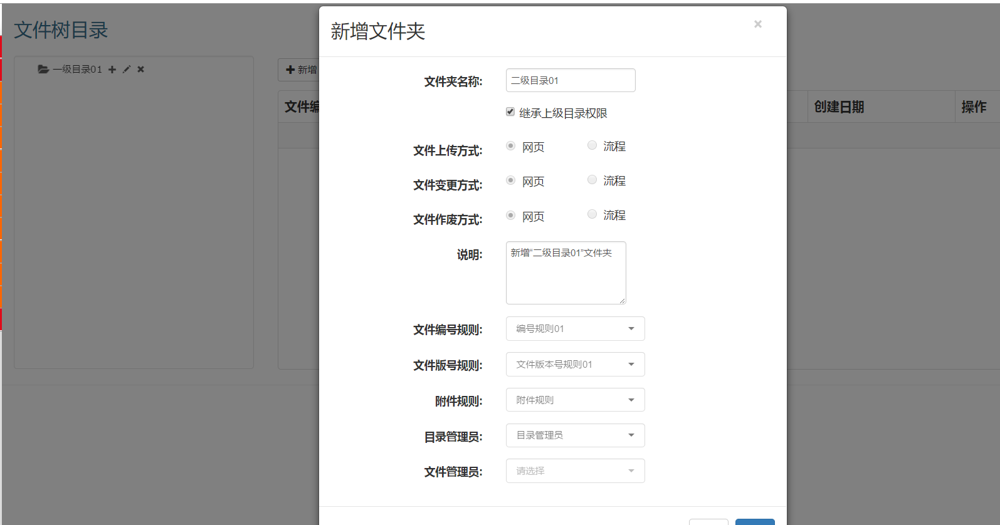
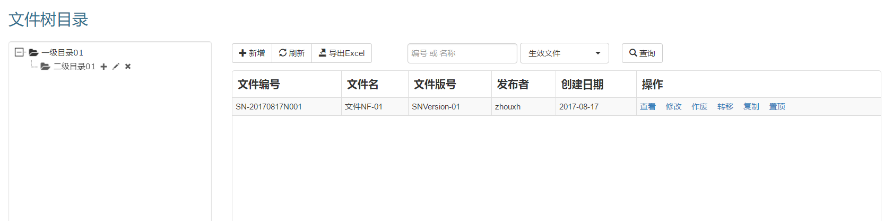

# DMS用户操作手册

--------

|日期|版本|作者|
|:---------:|:---------:|:---------:|
|2017/08/17|Version 1.0| 周兴怀 |

> **注意**，当前版本DMS只支持最新版Chrome跟火狐浏览器，**不支持IE**！

## 添加管理员角色

* DMS部署完成之后，用administrator登录GP, 在 “DMS > 设置” 页面“权限”页签中，添加两组权限，类型分别为 *“目录管理员”* 和 *“文件管理员”*:

> *“目录管理员”* 类别至少要设置一个(也可添加多个)，而 *“文件管理员”* 类别可以设置多个，也可以不设置，视需求而定。*“目录管理员”* 拥有指定目录和目录下文件的所有操作权限，而 *“文件管理员”* 只拥有指定目录下文件的部分操作权限。

* 可根据需要设定 *“编号规则”*，*“版号规则”* 和 *“附件规则”*。

## 添加目录

* 一级目录只能由administrator添加或删除，所以，先用administrator登录GP,打开“文件树”页面，点击 **“+”** 添加一级目录:

* 一级目录添加完成之后，再由有权限的用户登录GP，操作一级目录（添加子目录或者添加文件）。

